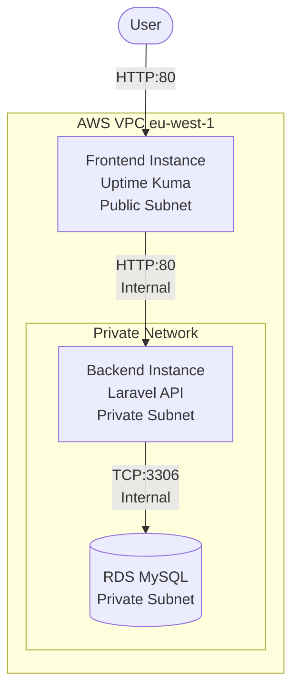

# Obelion Cloud Infrastructure & CI/CD

This repository contains the complete Infrastructure as Code (Terraform) and CI/CD automation (GitHub Actions/Docker) for the Obelion Cloud challenge.

## 🏗 System Architecture

The project deploys a secure, 2-tier architecture on AWS:



## 📂 Repository Structure

- `terraform/`: Complete Terraform configuration broken down into modules.
    - `modules/01-vpc`: Networking (VPC, IGW).
    - `modules/06-instances`: EC2 Compute resources.
    - `modules/08-nacl`: Network Access Control Lists (Security).
- `apps/`: Application source code and deployment logic.
    - `frontend/`: Uptime Kuma Docker configuration.
    - `backend/`: Laravel API Application & Workflows.

## 🚀 Setup & Deployment

### 1. Infrastructure (Terraform)
Navigate to the terraform directory and apply the configuration:
```bash
cd terraform
terraform init
terraform apply
```
**Outputs:**
- `Frontend-Public-IP`: Access Uptime Kuma.
- `Backend-Private-IP`: Internal API IP for monitoring.

### 2. Frontend Application (Uptime Kuma)
Uptime Kuma is automatically deployed via `user_data` and Docker Compose.
- **Access**: `http://<Frontend-IP>`
- **Default Port**: 80

### 3. Backend Application (Laravel)
The backend is provisioned on a private instance.
- **Access**: Internal Only (`http://10.0.x.x`).
- **Deployment**: Automatic via GitHub Actions (or Manual Script).

## 📸 Screenshots

### 1. Initial Setup


### 2. Dashboard


### 3. Adding Backend Monitor


### 4. Verified Connectivity (Up)

