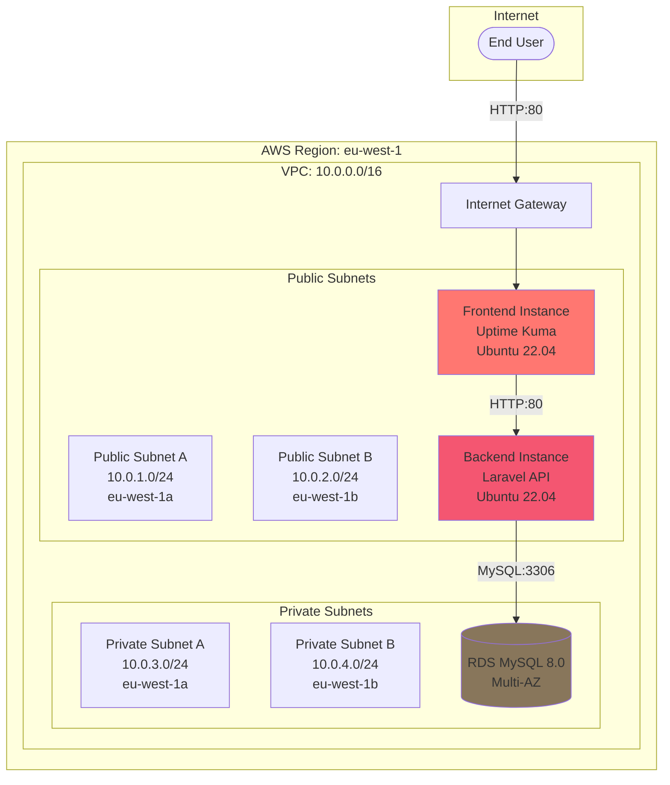
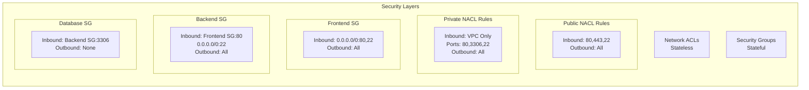
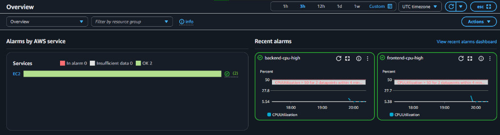
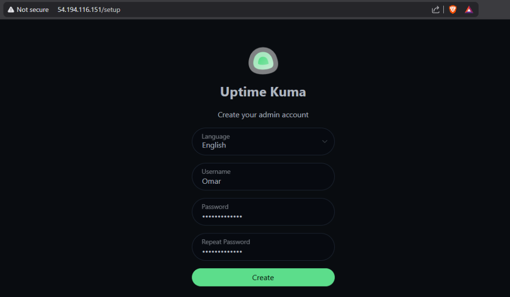
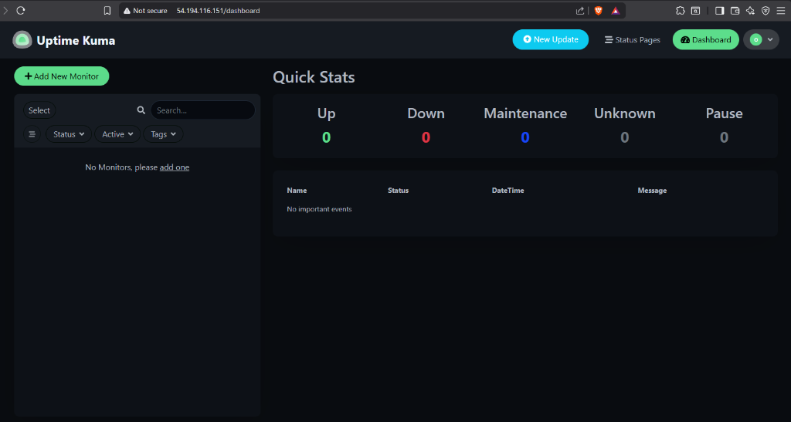
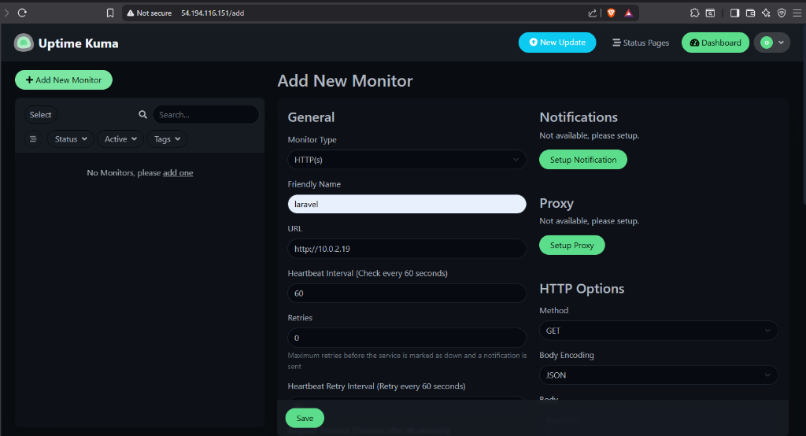
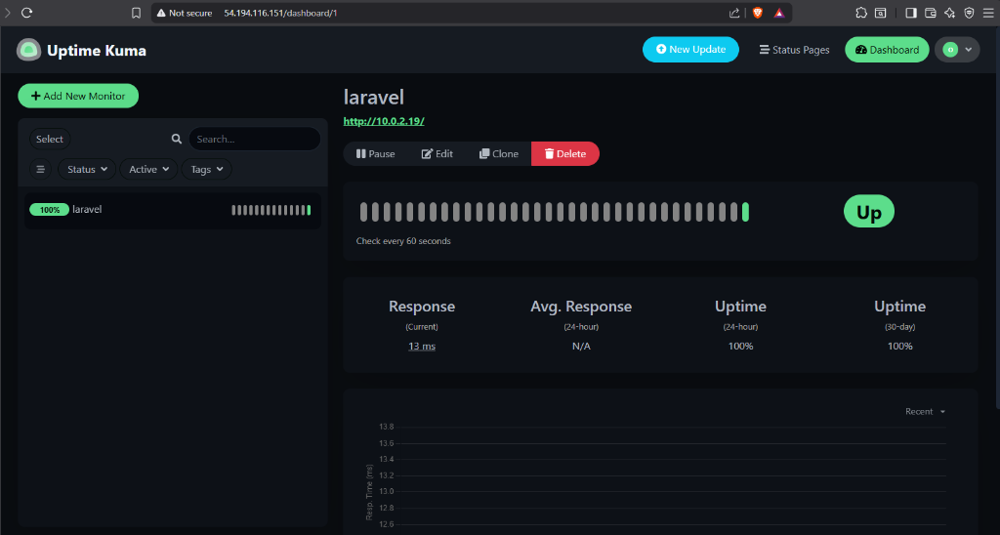
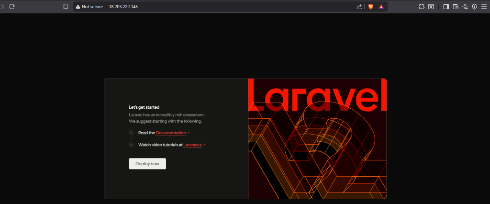

# Obelion Cloud Infrastructure and CI/CD Automation

This repository contains production-ready Infrastructure as Code (Terraform) and Continuous Integration/Continuous Deployment (CI/CD) automation using GitHub Actions for a secure, scalable 2-tier web application architecture on Amazon Web Services.

## Table of Contents

- [Architecture Overview](#architecture-overview)
- [Infrastructure Components](#infrastructure-components)
- [Repository Structure](#repository-structure)
- [Prerequisites](#prerequisites)
- [Deployment Guide](#deployment-guide)
- [CI/CD Pipeline](#cicd-pipeline)
- [Security Configuration](#security-configuration)
- [Monitoring](#monitoring)
- [Application Details](#application-details)
- [Screenshots](#screenshots)

## Architecture Overview

### High-Level Architecture



### Network Security Architecture



## Infrastructure Components

### Compute Resources

| Component | Type | Specifications | Subnet Type |
|-----------|------|----------------|-------------|
| Frontend | EC2 t2.micro | 1 vCPU, 1GB RAM, 8GB EBS | Public |
| Backend | EC2 t2.micro | 1 vCPU, 1GB RAM, 8GB EBS | Public |

### Database

| Component | Engine | Version | Storage | Availability |
|-----------|--------|---------|---------|--------------|
| RDS Instance | MySQL | 8.0 | 20GB gp2 | Multi-AZ |

### Networking

- **VPC CIDR**: 10.0.0.0/16
- **Public Subnets**: 10.0.1.0/24 (AZ-a), 10.0.2.0/24 (AZ-b)
- **Private Subnets**: 10.0.3.0/24 (AZ-a), 10.0.4.0/24 (AZ-b)
- **Internet Gateway**: Provides internet access for public subnets

## Repository Structure

```
Obelion-Cloud-task/
├── terraform/
│   ├── main.tf                      # Root module orchestration
│   ├── variables.tf                 # Input variables
│   ├── output.tf                    # Output values
│   ├── provider.tf                  # AWS provider configuration
│   └── modules/
│       ├── 01-vpc/                  # VPC and Internet Gateway
│       ├── 02-subnet/               # Public and private subnets
│       ├── 03-route_table/          # Route tables and associations
│       ├── 04-security_group/       # Security group definitions
│       ├── 05-RDS/                  # RDS database configuration
│       │   ├── Subnet-groups/       # DB subnet groups
│       │   └── Parameter-groups/    # DB parameter groups
│       ├── 06-instances/            # EC2 instance definitions
│       │   ├── docker-script.sh     # Frontend initialization
│       │   └── backend-script.sh    # Backend initialization
│       ├── 07-monitoring/           # CloudWatch alarms and SNS
│       └── 08-nacl/                 # Network Access Control Lists
├── apps/
│   ├── frontend/
│   │   ├── docker-compose.yml       # Uptime Kuma service definition
│   │   └── .github/workflows/
│   │       └── deploy.yml           # Frontend CI/CD pipeline
│   └── backend/
│       ├── .env.example             # Environment template
│       └── .github/workflows/
│           └── deploy.yml           # Backend CI/CD pipeline
├── task-group-c-azure-migration/    # Optional: Azure migration plan
│   └── README.md                    # Detailed AWS to Azure migration strategy
└── screenshots/                     # Deployment verification images
```

## Prerequisites

### Required Tools

- Terraform >= 1.0.0
- AWS CLI configured with appropriate credentials
- SSH key pair for EC2 access
- Git

### AWS Permissions

The AWS IAM user/role must have permissions to create:
- VPC, Subnets, Route Tables, Internet Gateway, NAT Gateway
- EC2 Instances, Security Groups, Network ACLs
- RDS Instances, DB Subnet Groups, DB Parameter Groups
- CloudWatch Alarms, SNS Topics

## Deployment Guide

### Step 1: Infrastructure Provisioning

1. Clone this repository:
```bash
git clone https://github.com/Omarh4700/Obelion-Cloud-task.git
cd Obelion-Cloud-task/terraform
```

2. Initialize Terraform:
```bash
terraform init
```

3. Review the planned changes:
```bash
terraform plan
```

4. Apply the configuration:
```bash
terraform apply
```

5. Note the outputs:
```
Outputs:

Frontend-Public-IP = "54.194.116.151"
Backend-Public-IP = "18.203.222.145"
RDS-Endpoint = "obelion-cloud-rds.c1qkys0u0tcq.eu-west-1.rds.amazonaws.com"
```

### Step 2: Application Deployment

#### Frontend Application (Uptime Kuma)

The frontend is automatically deployed via the `user_data` script which:
1. Installs Docker and Docker Compose
2. Clones the Uptime Kuma repository: https://github.com/Omarh4700/uptime-kuma.git
3. Starts the container on port 80

Access the frontend at: `http://<Frontend-Public-IP>`

#### Backend Application (Laravel)

The backend is automatically provisioned with:
1. PHP 8.3 and required extensions
2. Composer (latest version)
3. Apache2 web server

The application code is deployed via GitHub Actions from: https://github.com/Omarh4700/laravel.git

## CI/CD Pipeline

### Frontend Workflow

**Trigger**: Push to `master` branch

**Workflow File**: `apps/frontend/.github/workflows/deploy.yml`

**Pipeline Stages**:
1. **Build**: Validation and preparation
2. **Deploy**: 
   - SSH into Frontend instance
   - Pull latest changes from repository
   - Restart Docker containers

### Backend Workflow

**Trigger**: Push to `main` branch

**Workflow File**: `apps/backend/.github/workflows/deploy.yml`

**Pipeline Stages**:
1. **Deploy**:
   - SSH into Backend instance
   - Pull latest code changes
   - Create/update `.env` file with secrets
   - Install dependencies via Composer
   - Generate application key
   - Run database migrations

### Required GitHub Secrets

#### Frontend Repository Secrets:
- `HOST_DNS`: Frontend instance public IP
- `USERNAME`: `ubuntu`
- `SSH_PRIVATE_KEY`: Private key content for SSH access

#### Backend Repository Secrets:
- `HOST_DNS`: Backend instance public IP
- `USERNAME`: `ubuntu`
- `SSH_PRIVATE_KEY`: Private key content for SSH access
- `DB_HOST`: RDS endpoint
- `DB_NAME`: Database name (`accounts`)
- `DB_USERNAME`: Database username (`admin`)
- `DB_PASSWORD`: Database password

## Security Configuration

### Defense in Depth

The architecture implements multiple layers of security:

#### 1. Network Access Control Lists (NACLs)

**Public Subnet NACL**:
- Inbound: Allow ports 22, 80, 443, and ephemeral ports (1024-65535)
- Outbound: Allow all traffic

**Private Subnet NACL**:
- Inbound: Allow ports 22, 80, 3306 from VPC CIDR (10.0.0.0/16)
- Inbound: Allow ephemeral ports for return traffic
- Outbound: Allow all traffic

#### 2. Security Groups

**Frontend Security Group**:
- Inbound: HTTP (80) from 0.0.0.0/0
- Inbound: SSH (22) from 0.0.0.0/0
- Outbound: All traffic

**Backend Security Group**:
- Inbound: HTTP (80) from Frontend Security Group only
- Inbound: SSH (22) from 0.0.0.0/0
- Outbound: All traffic
- Outbound: MySQL (3306) to Database Security Group

**Database Security Group**:
- Inbound: MySQL (3306) from Backend Security Group only
- No outbound rules (stateful - return traffic allowed)

#### 3. Network Isolation

- Database instances deployed in private subnets with no direct internet access
- All sensitive data traffic isolated within VPC

### Security Best Practices

- SSH keys used instead of passwords
- Database credentials stored in GitHub Secrets
- Principle of least privilege for security group rules
- Multi-AZ deployment for RDS (high availability)
- Regular security group audits recommended

## Monitoring

### CloudWatch Alarms

The infrastructure includes CloudWatch alarms for:

- **Frontend CPU Utilization**: Alert when CPU > 80%
- **Backend CPU Utilization**: Alert when CPU > 80%



### SNS Notifications

Alarms trigger SNS topic which can send notifications to configured email addresses.

### Application Monitoring

Uptime Kuma provides:
- HTTP/HTTPS monitoring
- Response time tracking
- Uptime percentage calculation
- Alert notifications

**Monitoring the Backend API**:
1. Log into Uptime Kuma at `http://<Frontend-IP>`
2. Add new monitor:
   - Type: HTTP(s)
   - URL: `http://10.0.2.19` (Backend private IP)
   - Interval: 60 seconds

## Application Details

### Frontend: Uptime Kuma

**Repository**: https://github.com/Omarh4700/uptime-kuma.git

**Technology Stack**:
- Node.js
- Vue.js
- SQLite (local storage)

**Features**:
- Real-time monitoring dashboard
- Multiple monitor types (HTTP, TCP, Ping, etc.)
- Notification integrations
- Status page generation

**Access**: Port 80 on Frontend instance public IP

### Backend: Laravel API

**Repository**: https://github.com/Omarh4700/laravel.git

**Technology Stack**:
- PHP 8.3
- Laravel Framework
- MySQL 8.0 (RDS)
- Apache2 web server

**Features**:
- RESTful API endpoints
- Database migrations
- Environment-based configuration
- Composer dependency management

**Access**: Port 80 on Backend instance (Public Subnet B)

**Database Connection**:
- Host: RDS endpoint
- Port: 3306
- Database: mydb
- Credentials: Managed via GitHub Secrets

## Screenshots

### 1. Initial Setup


The first-time setup screen for Uptime Kuma where admin credentials are configured.

### 2. Dashboard


Clean dashboard interface showing monitor status summary.

### 3. Adding Backend Monitor


Configuration screen for adding a new HTTP monitor pointing to the Laravel backend API.

### 4. Verified Connectivity


Successful monitoring showing the Laravel backend is up with 100% uptime and response time metrics.

### 5. Laravel Backend Application


Laravel welcome page confirming the backend application is properly configured and accessible at the backend public IP.

## Troubleshooting

### Common Issues

**Issue**: Cannot access frontend
- **Solution**: Verify Security Group allows inbound traffic on port 80
- **Solution**: Check that instance is in a public subnet with Internet Gateway route

**Issue**: Backend cannot connect to database
- **Solution**: Verify environment variables are correctly set in `.env`
- **Solution**: Check Security Group allows MySQL traffic from Backend to Database

**Issue**: Backend shows Apache default page instead of Laravel application
- **Solution**: This is automatically fixed in the `backend-script.sh` user_data script
- **Solution**: The script configures Apache DocumentRoot to `/home/ubuntu/app/public`
- **Solution**: If manually deployed, update `/etc/apache2/sites-available/000-default.conf`:
  ```bash
  sudo sed -i 's|DocumentRoot /var/www/html|DocumentRoot /home/ubuntu/app/public|g' /etc/apache2/sites-available/000-default.conf
  sudo systemctl restart apache2
  ```
- **Solution**: Ensure mod_rewrite is enabled: `sudo a2enmod rewrite && sudo systemctl restart apache2`

**Issue**: CI/CD deployment fails
- **Solution**: Verify GitHub Secrets are configured correctly
- **Solution**: Check SSH key has correct permissions (600)
- **Solution**: Ensure branch names match workflow triggers

### Useful Commands

**Check application status on Frontend**:
```bash
ssh -i <key.pem> ubuntu@<Frontend-IP>
sudo docker ps
sudo docker logs uptime-kuma
```

**Check application status on Backend**:
```bash
ssh -i <key.pem> ubuntu@<Backend-IP>
cd ~/app
php artisan --version
sudo systemctl status apache2
```

**View Terraform state**:
```bash
terraform show
terraform output
```

## License

This infrastructure code is provided as-is for the Obelion Cloud challenge.

## Author

Omar - https://github.com/Omarh4700

## Repository Links

- **This Infrastructure Repository**: https://github.com/Omarh4700/Obelion-Cloud-task
- **Frontend Application**: https://github.com/Omarh4700/uptime-kuma
- **Backend Application**: https://github.com/Omarh4700/laravel
